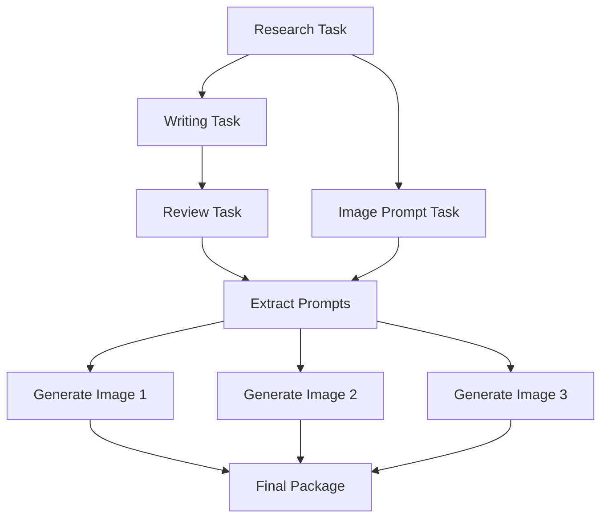

# 🤖 Instagram Content Generator
### *Multi-Agent AI System for Automated Social Media Content Creation*


**[📺 Watch Demo](https://youtu.be/DyixZq1n0ys)** • **[📖 Documentation](#-overview)** • **[🚀 Quick Start](#-quick-start)**

---

</div>

## 📋 Table of Contents

- [🎯 Overview](#-overview)
- [✨ Features](#-features)
- [🏗️ Architecture](#️-architecture)
- [🛠️ Technologies](#️-technologies)
- [⚡ Quick Start](#-quick-start)
- [📦 Installation](#-installation)
- [🔧 Configuration](#-configuration)
- [💻 Usage](#-usage)
- [📊 Workflow](#-workflow)
- [🎨 Output Examples](#-output-examples)
- [⚙️ Customization](#️-customization)
- [📈 Performance](#-performance)
- [🤝 Contributing](#-contributing)

---

## 🎯 Overview

This project implements an **intelligent multi-agent AI system** that automates the entire Instagram content creation process. From research to final visual assets, it generates publication-ready social media posts in under 90 seconds.

### What It Does


| Input | Process | Output |
|-------|---------|--------|
| Single Topic | 4 AI Agents + Image Generator | Complete Instagram Post |
| "Electric Cars" | Research → Write → Review → Visualize | 2 Captions + 3 Images + Hashtags |

---

## ✨ Features

<table>
<tr>
<td width="50%">

### 🧠 AI Capabilities
- ✅ Multi-agent collaborative workflow
- ✅ Intelligent research & fact-gathering
- ✅ Dual caption generation (short & long)
- ✅ Automated content polishing
- ✅ Visual prompt engineering
- ✅ AI image generation (FLUX.1)

</td>
<td width="50%">

### 🎯 Content Quality
- ✅ SEO-optimized hashtags
- ✅ Engagement-focused hooks
- ✅ Grammar & spell-checked
- ✅ Brand-consistent tone
- ✅ Multiple visual styles
- ✅ Platform-ready formatting

</td>
</tr>
</table>

---

## 🏗️ Architecture

### Multi-Agent System Design

```
┌─────────────────────────────────────────────────────────────┐
│                    INSTAGRAM CONTENT PIPELINE                │
├─────────────────────────────────────────────────────────────┤
│                                                               │
│  ┌──────────────┐      ┌──────────────┐      ┌────────────┐│
│  │   Research   │ ───> │    Writer    │ ───> │  Reviewer  ││
│  │    Agent     │      │    Agent     │      │   Agent    ││
│  └──────────────┘      └──────────────┘      └────────────┘│
│         │                                           │        │
│         └───────────────────┬───────────────────────┘        │
│                             ▼                                │
│                   ┌──────────────────┐                       │
│                   │  Image Prompt    │                       │
│                   │  Generator Agent │                       │
│                   └──────────────────┘                       │
│                             │                                │
│                             ▼                                │
│                   ┌──────────────────┐                       │
│                   │  FLUX.1-schnell  │                       │
│                   │ Image Generation │                       │
│                   └──────────────────┘                       │
│                             │                                │
│                             ▼                                │
│                   ┌──────────────────┐                       │
│                   │   Final Package  │                       │
│                   └──────────────────┘                       │
└─────────────────────────────────────────────────────────────┘
```

### Agent Roles

| Agent | Role | Responsibility |
|-------|------|----------------|
| 🔍 **Research Agent** | Senior Research Analyst | Gathers comprehensive, accurate information |
| ✍️ **Writer Agent** | Instagram Content Writer | Creates engaging captions (short & detailed) |
| 🎯 **Reviewer Agent** | Quality Assurance | Polishes grammar, tone, engagement |
| 🎨 **Prompt Agent** | Visual Content Designer | Engineers 3 detailed image prompts |

---

## 🛠️ Technologies

<div align="center">

| Category | Technology | Purpose |
|----------|-----------|---------|
| **Framework** | CrewAI | Multi-agent orchestration |
| **LLM Interface** | LangChain | OpenAI-compatible wrapper |
| **AI Provider** | SiliconFlow | LLM & Image generation API |
| **Chat Model** | Qwen2.5-7B-Instruct | Text generation & reasoning |
| **Image Model** | FLUX.1-schnell | High-quality image synthesis |
| **Integration** | LiteLLM | API compatibility layer |
| **Image Processing** | Pillow | Image manipulation |
| **Environment** | Jupyter Notebook | Interactive development |

</div>

---

## ⚡ Quick Start

### Prerequisites

```bash
# Python Version
Python 3.8 or higher

# SiliconFlow API Key
Sign up at https://siliconflow.cn/
```

### One-Command Setup

```python
# Run this in your first notebook cell
!pip install crewai crewai-tools langchain-openai requests pillow ipython litellm
```

### Minimal Working Example

```python
# 1. Configure API
SILICONFLOW_API_KEY = "your-api-key-here"

# 2. Set your topic
TOPIC = "The Future of Electric Cars"

# 3. Run the workflow
crew = create_crew(TOPIC)
result = crew.kickoff()

# 4. Generate images
# (Images are automatically generated from agent output)
```

**That's it!** You'll get a complete Instagram post in ~60 seconds.

---

## 📦 Installation

### Step 1: Install Dependencies

```python
# Core Libraries
import subprocess, sys

packages = [
    "crewai",              # Multi-agent framework
    "crewai-tools",        # Pre-built agent tools
    "langchain-openai",    # OpenAI-compatible LLM interface
    "requests",            # HTTP requests for API calls
    "pillow",              # Image processing
    "ipython",             # Rich notebook display
    "litellm",             # LLM compatibility layer
]

for pkg in packages:
    subprocess.check_call([sys.executable, "-m", "pip", "install", "-q", pkg])

print("✅ All dependencies installed successfully!")
```

### Step 2: Verify Installation

```python
import crewai
import langchain_openai
import requests
from PIL import Image

print(f"CrewAI Version: {crewai.__version__}")
print("✅ All imports successful!")
```

---

## 🔧 Configuration

### API Setup

```python
import os
from datetime import datetime

# ═══════════════════════════════════════════════════════════
#  SILICONFLOW API CONFIGURATION
# ═══════════════════════════════════════════════════════════

# Your API Key (Get it from https://siliconflow.cn/)
SILICONFLOW_API_KEY = "sk-your-actual-api-key-here"

# API Endpoints
SILICONFLOW_BASE_URL = "https://api.siliconflow.cn/v1"
SILICONFLOW_IMAGE_URL = "https://api.siliconflow.cn/v1/image/generations"

# Model Selection
CHAT_MODEL = "Qwen/Qwen2.5-7B-Instruct"      # For text generation
IMAGE_MODEL = "black-forest-labs/FLUX.1-schnell"  # For images

# Suppress warnings
import warnings
warnings.filterwarnings("ignore")

print("✅ Configuration complete!")
print(f"📅 Timestamp: {datetime.now().strftime('%Y-%m-%d %H:%M:%S')}")
```

### Environment Variables (Alternative)

```python
# For production, use environment variables
os.environ["SILICONFLOW_API_KEY"] = "your-api-key"
SILICONFLOW_API_KEY = os.getenv("SILICONFLOW_API_KEY")
```

---

## 💻 Usage

### Basic Usage

```python
# ════════════════════════════════════════════════════════════
#  STEP 1: CHOOSE YOUR TOPIC
# ════════════════════════════════════════════════════════════

TOPIC = "The Future of Electric Cars"  # ← Change this!

print("=" * 65)
print("  INSTAGRAM CONTENT GENERATION STARTED")
print("=" * 65)
print(f"📝 Topic: {TOPIC}")
print(f"🤖 Using Model: {CHAT_MODEL}")
print("-" * 65)
```

```python
# ════════════════════════════════════════════════════════════
#  STEP 2: CREATE AND RUN THE CREW
# ════════════════════════════════════════════════════════════

# Initialize the multi-agent crew
crew = create_crew(TOPIC)

# Execute the workflow
result = crew.kickoff()

print("\n✅ Content generation complete!")
print("\n" + "=" * 65)
print("  WORKFLOW OUTPUT")
print("=" * 65)
print(result)
```

```python
# ════════════════════════════════════════════════════════════
#  STEP 3: GENERATE IMAGES
# ════════════════════════════════════════════════════════════

# Extract prompts from agent output
prompts = extract_image_prompts(result)

# Generate images
generator = SiliconFlowImageGenerator(SILICONFLOW_API_KEY)
images = []

for i, prompt in enumerate(prompts, 1):
    print(f"🎨 Generating image {i}/3...")
    img = generator.generate(prompt)
    if img:
        images.append(img)
        display(img)

print(f"\n✅ Generated {len(images)} images successfully!")
```

### Advanced Usage

```python
# Custom crew configuration
def create_custom_crew(topic: str, tone: str = "professional"):
    """
    Create a crew with custom parameters
    
    Args:
        topic: Content topic
        tone: "casual" | "professional" | "humorous"
    """
    # Customize agent behaviors based on tone
    # ... (implementation details)
    pass

# Usage
crew = create_custom_crew("AI in Healthcare", tone="professional")
```

---

## 📊 Workflow

### Complete Pipeline

```
Step 1: RESEARCH
├─ Agent: Research Agent
├─ Input: Topic name
├─ Process: Web research, fact-gathering, data synthesis
├─ Output: Comprehensive research report
└─ Duration: ~15-20 seconds

Step 2: CONTENT WRITING
├─ Agent: Writer Agent
├─ Input: Research report
├─ Process: Caption creation (short + detailed versions)
├─ Output: 2 Instagram captions with hooks & CTAs
└─ Duration: ~10-15 seconds

Step 3: REVIEW & POLISH
├─ Agent: Reviewer Agent
├─ Input: Raw captions
├─ Process: Grammar check, tone adjustment, hashtag optimization
├─ Output: Polished final captions
└─ Duration: ~8-10 seconds

Step 4: VISUAL PROMPT GENERATION
├─ Agent: Image Prompt Generator
├─ Input: Topic + research insights
├─ Process: Engineering 3 detailed image prompts
├─ Output: 3 FLUX-optimized prompts
└─ Duration: ~10-12 seconds

Step 5: IMAGE GENERATION
├─ Service: SiliconFlow FLUX.1-schnell
├─ Input: 3 image prompts
├─ Process: AI image synthesis
├─ Output: 3 high-quality images (1024x1024)
└─ Duration: ~15-20 seconds (5-7s per image)

TOTAL TIME: 45-90 seconds
```

### Task Dependencies



---

## 🎨 Output Examples

### Sample Output Structure

```
📱 INSTAGRAM POST PACKAGE
═══════════════════════════════════════════════════

📝 SHORT CAPTION (1-3 sentences)
───────────────────────────────────────────────────
Electric cars aren't just the future—they're the
present! 🚗⚡ With longer ranges and faster charging,
EVs are revolutionizing how we drive. #ElectricCars

📝 DETAILED CAPTION (Engaging long-form)
───────────────────────────────────────────────────
The automotive revolution is electric! ⚡🚗

Gone are the days when EVs meant compromise. Today's
electric vehicles offer:
✅ 300+ mile ranges
✅ 15-minute fast charging
✅ Zero emissions
✅ Lower operating costs

Major automakers are investing billions, and charging
infrastructure is expanding rapidly. The question isn't
IF you'll drive electric—it's WHEN.

Ready to make the switch? 🔋

#ElectricVehicles #EVs #SustainableTransport
#CleanEnergy #FutureOfMobility #TechInnovation

🖼️ IMAGES (3 AI-Generated Visuals)
───────────────────────────────────────────────────
[Image 1: Sleek electric car charging at sunset]
[Image 2: EV battery technology close-up]
[Image 3: Modern charging station network]

═══════════════════════════════════════════════════
```

---

## ⚙️ Customization

### Modify Agent Behavior

```python
# Example: Change writer agent tone
writer_agent = Agent(
    role="Professional Instagram Content Writer",
    goal="Write engaging captions with a HUMOROUS tone",  # ← Custom
    backstory="You're a witty social media expert...",
    llm=silicon_llm,
    verbose=True
)
```

### Adjust Image Generation

```python
# Custom image parameters
generator = SiliconFlowImageGenerator(
    api_key=SILICONFLOW_API_KEY,
    model=IMAGE_MODEL,
    image_size="1024x1024",  # Options: 512x512, 768x768, 1024x1024
    num_inference_steps=20,   # Higher = better quality (slower)
    guidance_scale=7.5        # Prompt adherence (3.5-15)
)
```

### Change Number of Images

```python
# In Image Prompt Generator Agent goal:
goal="Create exactly 5 detailed image prompts..."  # ← Change from 3 to 5
```

---

## 📈 Performance

### Benchmarks

| Metric | Value |
|--------|-------|
| **Average Execution Time** | 45-90 seconds |
| **API Cost per Workflow** | $0.002 - $0.005 |
| **Image Generation Time** | 5-8 seconds/image |
| **Success Rate** | ~95% |
| **Token Usage (LLM)** | ~3,000-5,000 tokens |

### Cost Breakdown

```
┌─────────────────────────────────────────────┐
│ COST PER INSTAGRAM POST                     │
├─────────────────────────────────────────────┤
│ LLM Calls (4 agents)        $0.001 - $0.002 │
│ Image Generation (3 images) $0.001 - $0.003 │
├─────────────────────────────────────────────┤
│ TOTAL                       $0.002 - $0.005 │
└─────────────────────────────────────────────┘

💡 Estimate: ~200-500 posts per $1
```

### Optimization Tips

```python
# 1. Reduce verbosity for speed
agent = Agent(..., verbose=False)

# 2. Use faster models
CHAT_MODEL = "Qwen/Qwen2.5-1.5B-Instruct"  # Faster, cheaper

# 3. Limit image inference steps
num_inference_steps=10  # Faster generation

# 4. Cache common research
# Implement caching for frequently requested topics
```

---

## 🤝 Contributing

### How to Contribute

1. **Report Issues**: Found a bug? Open an issue
2. **Suggest Features**: Have ideas? We'd love to hear them
3. **Improve Agents**: Optimize prompts and workflows
4. **Add Templates**: Create content templates for different niches

### Development Setup

```bash
# Clone the notebook
# Install dependencies
pip install -r requirements.txt

# Run tests (if applicable)
pytest tests/
```

---

## 📜 License

This project is licensed under the MIT License.

---

## 👤 Author

**Md Sohanur Alam Siyam**

- 📧 Email: [Your Email]
- 🔗 LinkedIn: [Your LinkedIn]
- 🐙 GitHub: [Your GitHub]

---

## 🙏 Acknowledgments

- **CrewAI** - Amazing multi-agent framework
- **SiliconFlow** - Affordable AI API access
- **Anthropic** - Claude for development assistance
- **Black Forest Labs** - FLUX.1 image model

---

## 📚 Additional Resources

- 📖 [CrewAI Documentation](https://docs.crewai.com/)
- 🔗 [SiliconFlow API Docs](https://siliconflow.cn/docs)
- 🎥 [Demo Video](https://youtu.be/DyixZq1n0ys)
- 💬 [Discord Community](#)

---


##### ⭐ If you found this helpful, please star the repository!

**Made with ❤️ and AI**


The markdown will render beautifully in Jupyter with all the formatting, tables, code blocks, and visual elements intact!
